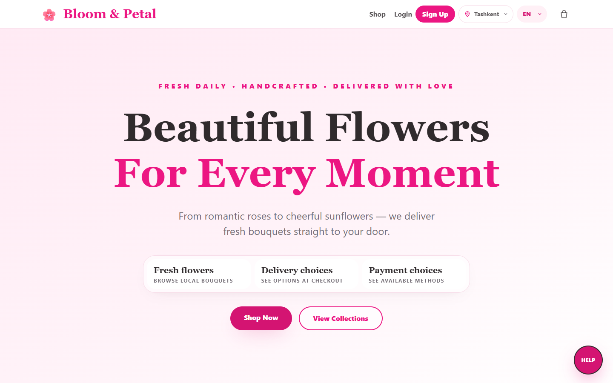

# Product screenshots

These are actual browser captures of the seeded local demo, not mockups. The
catalog uses demo products and the paid order uses the **test** provider; no
real card or customer data appears in these images. Captures were taken at
1440 × 900 (desktop) and 390 × 844 (mobile).

## Customer journey

| Screen | What it shows |
| --- | --- |
| [Catalog](screenshots/catalog.png) | API-backed products, stock badges, and demo photos |
| [Product detail](screenshots/product-detail.png) | Price, stock, delivery note, and description |
| [Reviews](screenshots/reviews.png) | Product-specific review section |
| [Cart](screenshots/cart.png) | Authenticated cart and total |
| [Checkout](screenshots/checkout.png) | Delivery form and payment choices |
| [Paid test order](screenshots/order-success.png) | Test-only payment confirmation; no money charged |
| [Order history](screenshots/order-history.png) | Payment state and fulfillment timeline |
| [Support chat](screenshots/support-chat.png) | Customer support widget |
| [Sign-in](screenshots/auth.png) | Email login and optional OAuth availability |

## Staff

| Screen | What it shows |
| --- | --- |
| [Workspace](screenshots/staff-dashboard.png) | Order metrics and delivery queue |
| [Support inbox](screenshots/support-inbox.png) | Staff conversation queue |

## Mobile

| Screen | What it shows |
| --- | --- |
| [Homepage](screenshots/mobile-homepage.png) | Responsive landing page |
| [Catalog](screenshots/mobile-catalog.png) | Single-column product browsing |
| [Checkout](screenshots/mobile-checkout.png) | Narrow-screen delivery form |
| [Profile](screenshots/mobile-profile.png) | Customer account settings |

## Reproducing the captures

Start Django and Next.js using the [local setup](../README.md#local-setup),
run `python manage.py seed_demo` **only against a development database**, and
use the demo customer or staff account printed by that command. Enable the
development test provider for the paid-order screen. Do not capture or commit
real customer information, access tokens, or provider credentials.

The former checklist also named empty search, a dedicated timeline, individual
staff order/stock pages, and Django admin screenshots. Those files were never
created, so they are not linked here. The order-history and workspace captures
already show the timeline, delivery queue, and staff overview.
